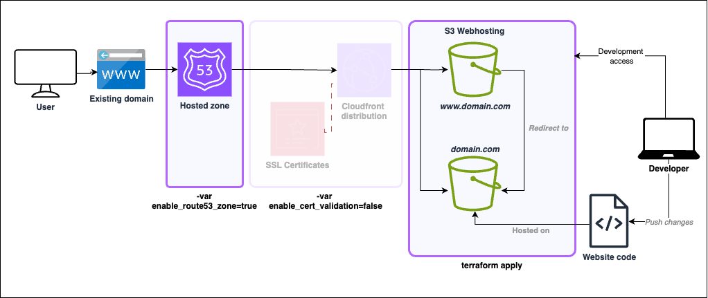

# Infrastructure

- [Infrastructure](#infrastructure)
  - [Overview](#overview)
  - [Pre-requisites](#pre-requisites)
    - [Existing domains](#existing-domains)
    - [AWS Account](#aws-account)
  - [Terraform module](#terraform-module)
    - [Variables](#variables)
  - [Usage](#usage)
    - [1. Route 53 host zone](#1-route-53-host-zone)
    - [2. Certified Infrastructure](#2-certified-infrastructure)
    - [3. Static Website Content](#3-static-website-content)
      - [3.1 Github actions CICD](#31-github-actions-cicd)
      - [Requirements](#requirements)
  - [Create only S3 buckets](#create-only-s3-buckets)

## Overview


This repository contains the infrastructure for static websites hosted on AWS.

Uses the following services:

- [AWS S3](https://aws.amazon.com/s3/): For storing the static website content.
- [AWS CloudFront](https://aws.amazon.com/cloudfront/): For serving the static website content.
- [AWS Route 53](https://aws.amazon.com/route53/): For managing the DNS records for the domain.
- [AWS Certificate Manager](https://aws.amazon.com/certificate-manager/): For managing the SSL certificate for the domain.

## Pre-requisites

### Existing domains

This module is designed to be used with already existing domains that are not managed by AWS.

### AWS Account

You will need to have an AWS account with the following permissions:

> **Note:** The following image shows the permissions granted with full access. Permission policies should be revised to match your needs.

- S3:Create, list, update and delete buckets
- Cloudfront: Create, invalidate and update distributions
- Route53: Create zones and manage DNS records
- ACM: Create and manage SSL certificates
  


> **Note:** The module assumes the existence of an existing domain and the corresponding DNS records. If not, you will need to create them before deploying the module.
>
___

## Terraform module


The Terraform module is designed to be used with already existing domains that are not managed by AWS, therefore it requires updating the DNS records manually after the Route53 zone is created.

### Variables

With `terraform apply`, all of the resources are created:

- `enable_route53_zone` ***(default: true)***: When true, creates Route53 hosted zone.
- `enable_cert_validation` ***(default: true)***: creates SSL certificate and CloudFront distribution.
- `website_name`: The name of the website
- `region`: AWS Region

## Usage

To deploy the infrastructure, run the following commands:

(use `plan` first to see what will be deployed)

### 1. Route 53 host zone



```sh
terraform apply -var='enable_cert_validation=false'
```

This will create the Route 53 host zone for the domain and output the name servers to be updated in the domain registrar.

Example:

```sh
name_servers=["NS1", "NS2", "NS3", "NS4"]
```

> **Replace the name servers in your domain registrar with the ones from the output.**

### 2. Certified Infrastructure


```sh
terraform apply 
```

This will create the rest of the resources for the website and create the SSL certificate.

### 3. Static Website Content

Navigating to the website URL you would  see this:


`404: The specified key does not exist.` This means the S3 bucket is empty or the object `index.html` does not exist at the root level.
  
Upload the static website content to the S3 bucket making sure the file structure is correct with `index.html` at the root.

#### 3.1 Github actions CICD

To automate the deployment, you can use Github actions.
Here's a [workflow example](docs/github-action/main.yml)

#### Requirements

- Branch named `main`
- Code source in `website/` directory
- Workflow file named `main.yml`
- Repository secrets:
  - `AWS_ACCESS_KEY_ID`
  - `AWS_SECRET_ACCESS_KEY`
  - `AWS_REGION`
  - `CLOUDFRONT_DISTRIBUTION_ID`
  - `S3_BUCKET_NAME`

## Create only S3 buckets

To create only the S3 buckets, run the following command:


```sh
terraform apply -var='enable_cert_validation=false' -var='enable_route53_zone=false'
```

--

Author: [Karis Omotosho](https://github.com/shonifari)

Github repo: [https://github.com/shonifari/aws-static-web-hosting](https://github.com/shonifari/aws-static-web-hosting)
